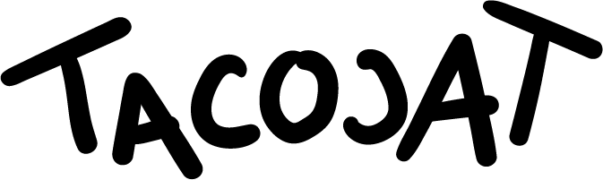

# A Palindrome Alogirthm

The Taco Cat coding challenge is based on the more traditional “Reverse a string” exercise but ultimately determines if a word or phrase is a palindrome. The Reverse a string exercise in some form has been used by technology companies such as Amazon, Microsoft, VMware and Norton to assess a candidate’s ability to code an impromptu algorithm.

## How It Works

This program has been designed to allow a user to enter any word or phrase, and the algorithm will strip that string of text of its white space, turn the characters into lower case, and return if that new version of the string has the same pattern backwards as it does forwards.

## Credits
Credits to these artists from dafont.com from providing the fonts I used in this build: Marsnev for “Lemon Milk’ and Chen Yining for ‘Louis George Café’.

## See This Website
[TACOCAT | A Coding Challenge](https://tacocatsj.netlify.app)

© Shyann Jobe 2020
